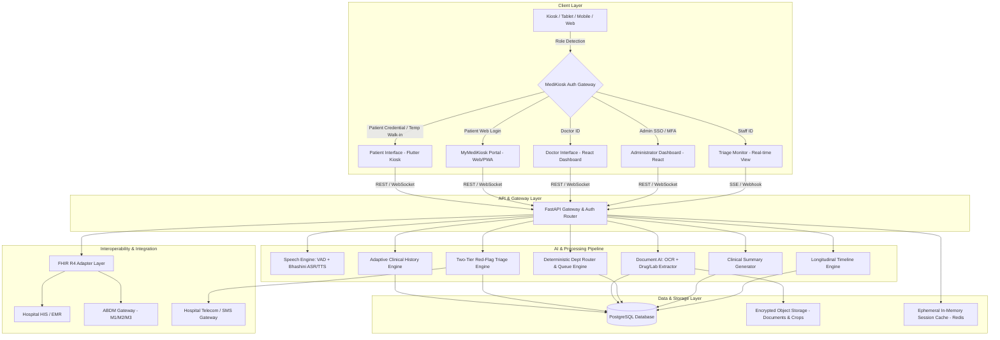
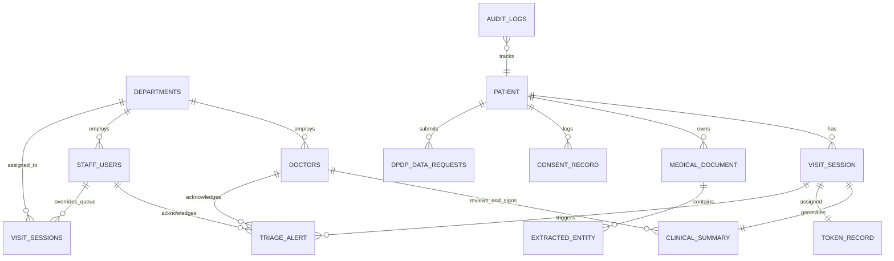
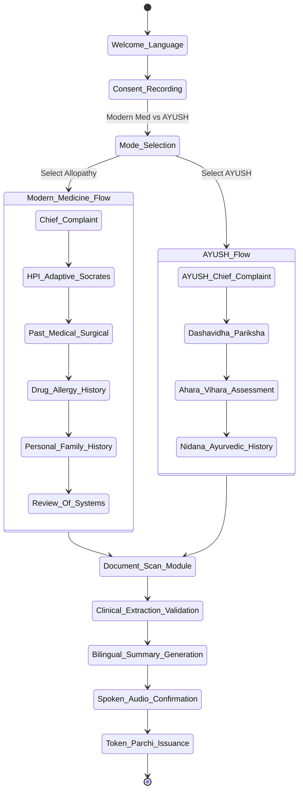
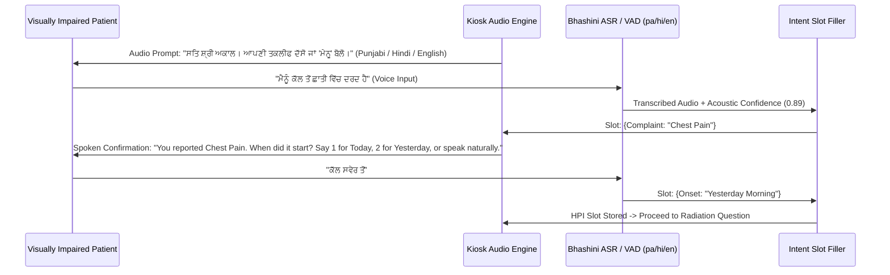
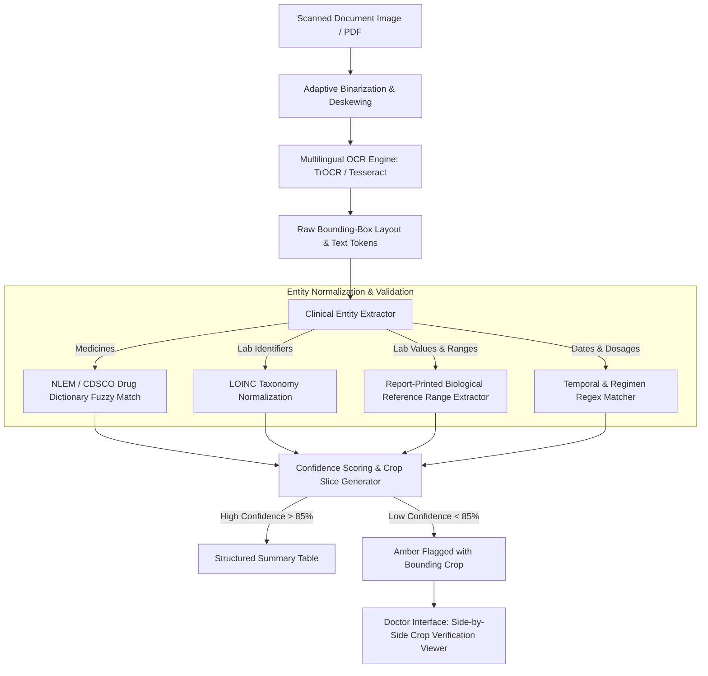
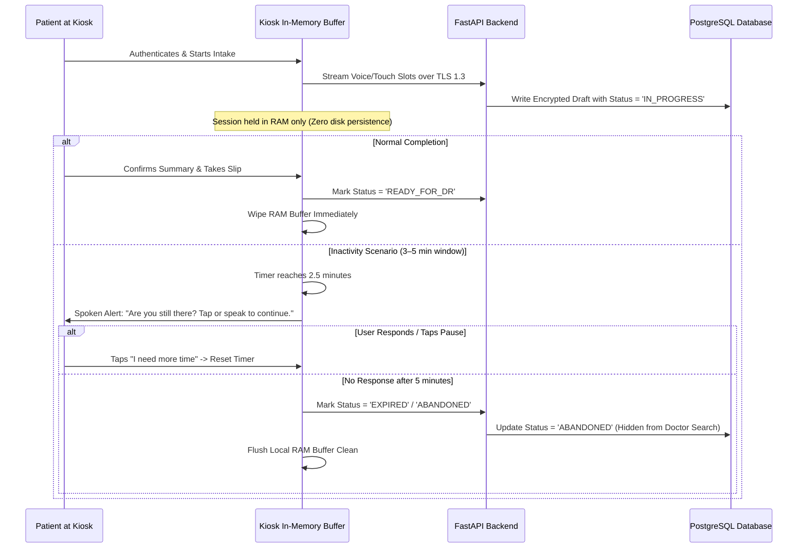

# MediKiosk — System Architecture & Technical Design Document (design.md)

---

## 1. System Overview & Architectural Principles

MediKiosk is an AI-powered, multilingual, accessibility-first clinical intake platform engineered for high-volume Indian hospital OPDs (Allopathic & AYUSH). 

### Core Architectural Principles:
1. **Clinical Safety & Physician-in-the-Loop:** MediKiosk does not diagnose or prescribe autonomously. It functions as an ontology-constrained intake slot-filler producing verifiable draft records. Every AI assertion is traceable to an audio timestamp or high-res document crop.
2. **Role-Based Dynamic Interface:** A unified platform with automatic credential-based routing into the **Patient Interface** (Kiosk/Tablet/PWA), **Doctor Interface** (Clinical Web Dashboard), **Triage Monitor**, or **Administrator Dashboard**.
3. **Multimodal Accessibility:** Voice-first interaction, large-format touch controls, high-contrast elderly modes, and a dedicated **zero-screen-touch audio-guided mode for visually impaired patients**.
4. **Dual Output & Zero-Smartphone Dependency:** Primary output is an auto-printed thermal paper token slip from the kiosk; digital OPD Parchi is optionally delivered via SMS/PWA for smartphone owners.
5. **Privacy & DPDP Act 2023 Compliance:** Ephemeral kiosk memory lifecycle (zero persistent storage on physical kiosks, 3–5 min inactivity timeout with spoken check-in), cryptographic signed QR tokens, reversible envelope encryption for SMS, tamper-evident audit logging with kiosk tracking, and explicit audio-visual consent records with full Data Principal rights (access, correction, erasure).

---

## 2. High-Level System Architecture



---

## 3. Data Models & Database Schema

The database is built on PostgreSQL with strict relational integrity, UUID primary keys, and JSONB fields for unstructured clinical observations.

### 3.1 Entity Relationship Diagram (ERD)



### 3.2 SQL Table Definitions

#### `departments`
```sql
CREATE TABLE departments (
    department_id VARCHAR(64) PRIMARY KEY,
    name VARCHAR(255) NOT NULL,
    system_type VARCHAR(32) NOT NULL, -- 'ALLOPATHY' or 'AYUSH'
    room_numbers TEXT[] NOT NULL,
    is_active BOOLEAN DEFAULT TRUE,
    created_at TIMESTAMP WITH TIME ZONE DEFAULT CURRENT_TIMESTAMP
);

-- Complete Standardized Seed Encodings
-- Allopathy: 'GEN_MED', 'CARDIOLOGY', 'ORTHOPEDICS', 'RHEUMATOLOGY', 'GASTROENTEROLOGY', 'DERMATOLOGY', 'EMERGENCY'
-- AYUSH: 'KAYACHIKITSA', 'PANCHAKARMA', 'SHALYA_TANTRA', 'HRIDROGA', 'TWAK_ROGA', 'AGNI_CHIKITSA', 'JWARA_CHIKITSA'
```

#### `doctors` & `staff_users`
```sql
CREATE TABLE doctors (
    doctor_id VARCHAR(64) PRIMARY KEY, -- e.g., 'DR-7012'
    full_name VARCHAR(255) NOT NULL,
    department_id VARCHAR(64) REFERENCES departments(department_id),
    medical_license_no VARCHAR(128) UNIQUE NOT NULL,
    password_hash VARCHAR(255) NOT NULL,
    
    -- Duty Roster Attributes for Real-Time SMS Escalation
    is_on_duty BOOLEAN DEFAULT FALSE,
    duty_phone_encrypted VARCHAR(512),
    
    -- Doctor MFA & Biometric/SSO Integrations
    mfa_secret VARCHAR(128), -- Encrypted TOTP secret (RFC 6238)
    sso_subject_id VARCHAR(255) UNIQUE,
    
    is_active BOOLEAN DEFAULT TRUE,
    created_at TIMESTAMP WITH TIME ZONE DEFAULT CURRENT_TIMESTAMP
);

CREATE TABLE staff_users (
    staff_id VARCHAR(64) PRIMARY KEY, -- e.g., 'ST-402'
    full_name VARCHAR(255) NOT NULL,
    role VARCHAR(32) NOT NULL, -- 'TRIAGE_NURSE', 'HOSPITAL_ADMIN', 'DEPT_ADMIN', 'SUPER_ADMIN', 'REGISTRATION_DESK'
    department_id VARCHAR(64) REFERENCES departments(department_id),
    password_hash VARCHAR(255) NOT NULL,
    
    -- Duty Roster Attributes for Real-Time SMS Escalation
    is_on_duty BOOLEAN DEFAULT FALSE,
    duty_phone_encrypted VARCHAR(512),
    
    -- Admin MFA & Enterprise SSO Integrations
    mfa_secret VARCHAR(128), -- Encrypted TOTP secret (RFC 6238)
    sso_provider VARCHAR(64), -- 'HOSPITAL_KEYCLOAK', 'MICROSOFT_ENTRA', 'GOOGLE_WORKSPACE'
    sso_subject_id VARCHAR(255) UNIQUE,
    
    is_active BOOLEAN DEFAULT TRUE,
    created_at TIMESTAMP WITH TIME ZONE DEFAULT CURRENT_TIMESTAMP
);
```

#### `patients`
```sql
CREATE TABLE patients (
    patient_id VARCHAR(32) PRIMARY KEY, -- e.g., 'MK-10452' or 'TEMP-98412'
    abha_id VARCHAR(64) UNIQUE,
    abha_address VARCHAR(128) UNIQUE,
    -- Reversible AES-256-GCM encryption for SMS Parchi delivery (KMS envelope encrypted)
    phone_encrypted VARCHAR(512) NOT NULL,
    -- Blind index HMAC-SHA256 hash for constant-time O(1) patient lookups without decrypting DB
    phone_search_hash VARCHAR(64) NOT NULL,
    full_name VARCHAR(255) NOT NULL,
    age INT NOT NULL,
    gender VARCHAR(16) NOT NULL,
    primary_language VARCHAR(32) DEFAULT 'hi',
    password_hash VARCHAR(255),
    
    -- Dedicated MPIN Storage with Brute-Force Rate Limiting
    mpin_hash VARCHAR(255),
    failed_mpin_attempts INT DEFAULT 0,
    mpin_locked_until TIMESTAMP WITH TIME ZONE,
    
    -- Temporary Walk-In Tracking & Merge Attributes
    is_temporary BOOLEAN DEFAULT FALSE,
    is_archived BOOLEAN DEFAULT FALSE,
    merged_into VARCHAR(32) REFERENCES patients(patient_id),
    
    created_at TIMESTAMP WITH TIME ZONE DEFAULT CURRENT_TIMESTAMP,
    updated_at TIMESTAMP WITH TIME ZONE DEFAULT CURRENT_TIMESTAMP
);
CREATE INDEX idx_patients_search_hash ON patients(phone_search_hash);
CREATE INDEX idx_patients_abha ON patients(abha_id);
```

#### `visit_sessions`
```sql
CREATE TABLE visit_sessions (
    session_id UUID PRIMARY KEY DEFAULT gen_random_uuid(),
    patient_id VARCHAR(32) REFERENCES patients(patient_id) ON DELETE CASCADE,
    visit_type VARCHAR(32) NOT NULL, -- 'MODERN_MEDICINE' or 'AYUSH'
    status VARCHAR(32) NOT NULL DEFAULT 'IN_PROGRESS', -- 'IN_PROGRESS', 'READY_FOR_DR', 'IN_CONSULTATION', 'COMPLETED', 'EXPIRED', 'ABANDONED'
    department_id VARCHAR(64) REFERENCES departments(department_id),
    assigned_room VARCHAR(32),
    created_at TIMESTAMP WITH TIME ZONE DEFAULT CURRENT_TIMESTAMP,
    completed_at TIMESTAMP WITH TIME ZONE,
    expires_at TIMESTAMP WITH TIME ZONE NOT NULL
);
CREATE INDEX idx_visit_patient ON visit_sessions(patient_id);
CREATE INDEX idx_visit_status ON visit_sessions(status);
```

#### `consent_records` & `dpdp_data_requests`
```sql
CREATE TABLE consent_records (
    consent_id UUID PRIMARY KEY DEFAULT gen_random_uuid(),
    session_id UUID REFERENCES visit_sessions(session_id) ON DELETE CASCADE,
    patient_id VARCHAR(32) REFERENCES patients(patient_id),
    purpose VARCHAR(255) NOT NULL,
    consented BOOLEAN NOT NULL,
    language_used VARCHAR(32) NOT NULL,
    audio_confirmation_logged BOOLEAN DEFAULT TRUE,
    timestamp TIMESTAMP WITH TIME ZONE DEFAULT CURRENT_TIMESTAMP,
    ip_or_kiosk_id VARCHAR(64) NOT NULL
);

CREATE TABLE dpdp_data_requests (
    request_id UUID PRIMARY KEY DEFAULT gen_random_uuid(),
    patient_id VARCHAR(32) REFERENCES patients(patient_id),
    request_type VARCHAR(32) NOT NULL, -- 'CORRECTION', 'ERASURE', 'ACCESS_LOG'
    status VARCHAR(32) NOT NULL DEFAULT 'PENDING', -- 'PENDING', 'PROCESSED', 'REJECTED'
    payload JSONB,
    requested_at TIMESTAMP WITH TIME ZONE DEFAULT CURRENT_TIMESTAMP,
    resolved_at TIMESTAMP WITH TIME ZONE
);
```

#### `clinical_summaries`
```sql
CREATE TABLE clinical_summaries (
    summary_id UUID PRIMARY KEY DEFAULT gen_random_uuid(),
    session_id UUID UNIQUE REFERENCES visit_sessions(session_id) ON DELETE CASCADE,
    patient_id VARCHAR(32) REFERENCES patients(patient_id),
    
    -- Allopathic Structured Data
    chief_complaint TEXT NOT NULL,
    hpi JSONB NOT NULL, -- {onset, duration, location, character, severity, radiation, aggravating, relieving, associated}
    past_medical_history JSONB, -- [{condition, duration, status}]
    past_surgical_history JSONB, -- [{procedure, year, notes}]
    drug_history JSONB, -- [{name, dose, frequency, confidence, source_doc_id}]
    allergies JSONB, -- [{allergen, reaction, severity}]
    family_history JSONB,
    personal_history JSONB, -- {diet, sleep, smoking, alcohol, habits}
    review_of_systems JSONB,
    
    -- AYUSH / Dashavidha Pariksha Data
    ayush_data JSONB, -- {prakriti, vikriti, sara, samhanana, pramana, satmya, sattva, ahara_shakti, vyayama_shakti, vaya, ahara_vihara, nidana}
    
    -- Verification & Sign-off State
    is_draft BOOLEAN DEFAULT TRUE,
    reviewed_by_doctor_id VARCHAR(64) REFERENCES doctors(doctor_id),
    physician_edits JSONB,
    signed_at TIMESTAMP WITH TIME ZONE,
    created_at TIMESTAMP WITH TIME ZONE DEFAULT CURRENT_TIMESTAMP
);
```

#### `medical_documents` & `extracted_entities`
```sql
CREATE TABLE medical_documents (
    document_id UUID PRIMARY KEY DEFAULT gen_random_uuid(),
    patient_id VARCHAR(32) REFERENCES patients(patient_id) ON DELETE CASCADE,
    session_id UUID REFERENCES visit_sessions(session_id),
    doc_type VARCHAR(64) NOT NULL, -- 'PRESCRIPTION', 'LAB_REPORT', 'DISCHARGE_SUMMARY', 'IMAGING'
    storage_path VARCHAR(512) NOT NULL,
    document_date DATE,
    hospital_or_clinic VARCHAR(255),
    created_at TIMESTAMP WITH TIME ZONE DEFAULT CURRENT_TIMESTAMP
);

CREATE TABLE extracted_entities (
    entity_id UUID PRIMARY KEY DEFAULT gen_random_uuid(),
    document_id UUID REFERENCES medical_documents(document_id) ON DELETE CASCADE,
    entity_type VARCHAR(64) NOT NULL, -- 'MEDICATION', 'LAB_VALUE', 'DIAGNOSIS'
    raw_text TEXT NOT NULL,
    normalized_name VARCHAR(255) NOT NULL,
    value VARCHAR(64),
    unit VARCHAR(32),
    reference_range VARCHAR(64),
    is_abnormal BOOLEAN DEFAULT FALSE,
    confidence_score NUMERIC(5,2) NOT NULL,
    bounding_box JSONB NOT NULL, -- {x, y, width, height, page}
    crop_image_path VARCHAR(512)
);
```

#### `token_records`, `triage_alerts` & `audit_logs`
```sql
CREATE TABLE token_records (
    token_id UUID PRIMARY KEY DEFAULT gen_random_uuid(),
    session_id UUID UNIQUE REFERENCES visit_sessions(session_id) ON DELETE CASCADE,
    patient_id VARCHAR(32) REFERENCES patients(patient_id),
    token_number INT NOT NULL,
    department_id VARCHAR(64) REFERENCES departments(department_id),
    priority_tier VARCHAR(16) NOT NULL DEFAULT 'STANDARD', -- 'STANDARD', 'AMBER_PRIORITY', 'RED_CRITICAL'
    signed_qr_token VARCHAR(512) NOT NULL,
    queue_status VARCHAR(32) NOT NULL DEFAULT 'WAITING', -- 'WAITING', 'CALLED', 'IN_ROOM', 'COMPLETED'
    issued_at TIMESTAMP WITH TIME ZONE DEFAULT CURRENT_TIMESTAMP
);

CREATE TABLE triage_alerts (
    alert_id UUID PRIMARY KEY DEFAULT gen_random_uuid(),
    session_id UUID REFERENCES visit_sessions(session_id) ON DELETE CASCADE,
    patient_id VARCHAR(32) REFERENCES patients(patient_id),
    tier VARCHAR(16) NOT NULL, -- 'TIER_1_CRITICAL', 'TIER_2_AMBER'
    symptom_trigger VARCHAR(255) NOT NULL,
    justification TEXT NOT NULL,
    acknowledged_by_id VARCHAR(64), -- doctor_id or staff_id
    acknowledged_by_role VARCHAR(32), -- 'TRIAGE_NURSE' or 'DOCTOR'
    acknowledged_at TIMESTAMP WITH TIME ZONE,
    created_at TIMESTAMP WITH TIME ZONE DEFAULT CURRENT_TIMESTAMP
);

CREATE TABLE audit_logs (
    log_id UUID PRIMARY KEY DEFAULT gen_random_uuid(),
    event_type VARCHAR(64) NOT NULL, -- 'AUTH_SUCCESS', 'AUTH_FAILURE', 'RECORD_ACCESS', 'CONSENT_CHANGE', 'TRIAGE_ALERT', 'DATA_ERASURE', 'PATIENT_RECORD_MERGE', 'ADMIN_ACTION'
    user_id VARCHAR(64), -- patient_id, doctor_id, staff_id, or 'SYSTEM'
    user_role VARCHAR(32) NOT NULL,
    target_patient_id VARCHAR(32), -- if accessing/modifying patient health data
    ip_address VARCHAR(45),
    client_or_kiosk_id VARCHAR(64), -- e.g., 'KIOSK_OPD_01'
    action_details JSONB NOT NULL,
    status VARCHAR(16) NOT NULL, -- 'SUCCESS', 'DENIED', 'ERROR'
    timestamp TIMESTAMP WITH TIME ZONE DEFAULT CURRENT_TIMESTAMP
);
CREATE INDEX idx_audit_event ON audit_logs(event_type, timestamp);
CREATE INDEX idx_audit_target_patient ON audit_logs(target_patient_id);
```

### 3.3 Zero-Filled Analytics View (`v_opd_intake_metrics`)

```sql
CREATE OR REPLACE VIEW v_opd_intake_metrics AS
SELECT 
    d.department_id,
    d.name AS department_name,
    d.system_type,
    CURRENT_DATE AS metric_date,
    COALESCE(COUNT(v.session_id), 0) AS total_intakes_initiated,
    COALESCE(COUNT(CASE WHEN v.status = 'COMPLETED' THEN 1 END), 0) AS completed_intakes,
    COALESCE(COUNT(CASE WHEN v.status IN ('EXPIRED', 'ABANDONED') THEN 1 END), 0) AS abandoned_intakes,
    COALESCE(
        ROUND(COUNT(CASE WHEN v.status = 'COMPLETED' THEN 1 END)::NUMERIC / NULLIF(COUNT(v.session_id), 0) * 100, 2), 
        0.00
    ) AS completion_rate_pct,
    COALESCE(
        ROUND(AVG(EXTRACT(EPOCH FROM (v.completed_at - v.created_at)) / 60)::NUMERIC, 2), 
        0.00
    ) AS avg_intake_duration_minutes,
    COALESCE(COUNT(t.alert_id) FILTER (WHERE t.tier = 'TIER_1_CRITICAL'), 0) AS tier_1_critical_count,
    COALESCE(COUNT(t.alert_id) FILTER (WHERE t.tier = 'TIER_2_AMBER'), 0) AS tier_2_amber_count
FROM departments d
LEFT JOIN visit_sessions v ON d.department_id = v.department_id AND DATE(v.created_at) = CURRENT_DATE
LEFT JOIN triage_alerts t ON v.session_id = t.session_id
GROUP BY d.department_id, d.name, d.system_type;
```

---

## 4. API Specification & Interface Contracts

All endpoints are built using FastAPI, authenticated via JWT Bearer tokens, with role-based claim checks.

### 4.1 Authentication & Granular JWT Claims
- `POST /api/v1/auth/login`
  - **Request:**
    ```json
    {
      "identifier": "DR-7012",
      "credential": "mypassword123", // or 4-digit MPIN / SSO Assertion
      "type": "DOCTOR_ID" // "PATIENT_PASSWORD" | "PATIENT_MPIN" | "ABHA_OTP" | "TEMP_WALKIN" | "DOCTOR_ID" | "STAFF_ID" | "ADMIN_SSO"
    }
    ```
  - **JWT Payload Schema:**
    ```json
    {
      "sub": "DR-7012",
      "role": "DOCTOR", // Top-level routing: "PATIENT" | "DOCTOR" | "STAFF" | "ADMIN"
      "staff_role": null,
      "dept_id": "CARDIOLOGY",
      "exp": 1757600000
    }
    ```

### 4.2 Conversational Intake Endpoints
- `POST /api/v1/intake/session/start`: Initializes session, logs consent, assigns ephemeral session token.
- `POST /api/v1/intake/speech-to-text`: Uploads audio blob (`audio/webm` or `audio/wav`), runs noise-reduction + Bhashini ASR (Hindi, English, Punjabi), returns transcribed text & intent.

#### Dialogue Turn — Modern Medicine Example
- `POST /api/v1/intake/dialogue-turn` (Request / Response):
  ```json
  // Request
  {
    "session_id": "9b1deb4d-3b7d-4bad-9bdd-2b0d7b3dcb6d",
    "user_input": "Mujhe kal se seene mein dard ho raha hai",
    "input_mode": "VOICE",
    "current_section": "CHIEF_COMPLAINT"
  }
  // Response
  {
    "extracted_slots": { "complaint": "Chest Pain", "onset": "Yesterday" },
    "next_question": {
      "prompt_text": "क्या यह दर्द आपके कंधे, गर्दन या बांह में जा रहा है?",
      "audio_url": "/api/v1/audio/prompts/hpi_radiation_hi.mp3",
      "input_type": "YES_NO_UNSURE",
      "section": "HPI_RADIATION"
    },
    "red_flag_status": "MONITORING"
  }
  ```

#### Dialogue Turn — AYUSH / Dashavidha Pariksha Example
- `POST /api/v1/intake/dialogue-turn` (Request / Response):
  ```json
  // Request
  {
    "session_id": "9b1deb4d-3b7d-4bad-9bdd-2b0d7b3dcb6d",
    "user_input": "Mujhe hamesha ghabrahat hoti hai aur pait mein jalan rehti hai",
    "input_mode": "VOICE",
    "current_section": "DASHAVIDHA_PARIKSHA"
  }
  // Response
  {
    "extracted_slots": {
      "vikriti_dosha": "Pitta-Vata Imbalance",
      "agni_status": "Tikshnagni",
      "sattva": "Madhyama"
    },
    "next_question": {
      "prompt_text": "आपकी भूख और भोजन पचाने की शक्ति कैसी है?",
      "audio_url": "/api/v1/audio/prompts/ayush_ahara_shakti_hi.mp3",
      "input_type": "CHIP_SELECTION",
      "options": ["तीक्ष्णाग्नि (अति तीव्र भूख)", "विषमाग्नि (अनियमित भूख)", "मंदाग्नि (कम भूख)", "समाग्नि (सामान्य भूख)"],
      "section": "AHARA_SHAKTI"
    },
    "red_flag_status": "NONE"
  }
  ```

### 4.3 Document AI & OCR Endpoints
- `POST /api/v1/documents/upload-and-parse`: Accepts image/PDF, returns extracted medicines, lab values, report-extracted biological reference ranges, abnormal flags, and crop image URLs.
- `GET /api/v1/documents/crop/{entity_id}`: Fetches high-res cropped image slice for side-by-side verification.

### 4.4 Queue, Department Override, Duty Roster & Digital Parchi Endpoints
- `POST /api/v1/queue/issue-token`: Generates token number, builds signed QR code, compiles Digital OPD Parchi.
- `PUT /api/v1/queue/override-department`: Staff overrides routed department (`session_id`, `new_department_id`, `reason`).
- `PUT /api/v1/staff/duty-status`: 
  - **Duty Roster Toggle:** Allows doctors and nurses to clock-in/out for active Tier-1 SMS dispatch:
    ```json
    { "is_on_duty": true, "duty_phone": "+919876543210" }
    ```
- `GET /api/v1/queue/public-display/{department_id}`: Returns privacy-preserving list of plain token numbers and assigned rooms (`[{token: 47, room: "12", status: "NEXT"}]`).
- `GET /api/v1/parchi/{patient_id}`: Retrieves patient's active visit Digital OPD Parchi.

### 4.5 Doctor Interface Endpoints
- `GET /api/v1/doctor/opd-queue`: Returns doctor's departmental queue list with priority badges and intake readiness. Excludes abandoned/expired sessions.
- `GET /api/v1/doctor/patient-lookup/{patient_id}`: Universal Patient ID search returning today's symptoms, structured clinical summary, longitudinal timeline, abnormal labs, and scanned document crops. Filters out `EXPIRED` / `ABANDONED` draft records.
- `PUT /api/v1/doctor/summary/{summary_id}/sign`: Submits physician edits and signs the clinical note into permanent EMR status.

### 4.6 DPDP Patient Portal & Dual-Path Merge Endpoints (MyMediKiosk)
- `GET /api/v1/patient/consent-history`: Returns audit log of all granted consents.
- `POST /api/v1/patient/data-correction-request`: Logs an amendment request for demographic/clinical data.
- `POST /api/v1/patient/data-erasure-request`: Triggers DPDP-compliant cryptographic shredding of non-statutory visit logs.
- `POST /api/v1/patient/merge-temporary-record`:
  - **Dual-Path Security Check:** Accepts a single-use `verification_session_token` issued via **Path A (ABDM ABHA OTP)** or **Path B (Non-ABHA Mobile SMS OTP + MPIN Creation)**.
  - **Action:** Merges temporary visit history atomically into the permanent patient record, archives `TEMP-xxxx`, and writes a tamper-evident record to `audit_logs`.

### 4.7 Administrator Dashboard Endpoints
- `GET /api/v1/admin/analytics/overview`: High-level OPD KPIs (Total Intakes Today, Active Queue Depth, Avg Intake Duration, Red-Flag Incidents, Drop-off / Abandonment Rate).
- `GET /api/v1/admin/analytics/department-metrics`: Department-wise breakdown (Allopathy vs. AYUSH throughput, doctor review latency, wait times from `v_opd_intake_metrics`).
- `GET /api/v1/admin/audit-logs`: Queryable system-wide security, consent, and access audit trail with IP, actor, kiosk ID, and timestamp filters.

---

## 5. Core Engine Implementations

### 5.1 Adaptive Clinical History Engine & State Machine



### 5.2 Multi-Accent Speech Pipeline (Hindi, English, Punjabi) & Audio-Guided Flow

The speech engine integrates Bhashini Indian language models supporting **Hindi (`bhashini_asr_hi`)**, **English (`bhashini_asr_en`)**, and **Punjabi (`bhashini_asr_pa`)** (Majhi, Doabi, Malwai dialect tolerance):



### 5.3 Two-Tier Red-Flag Detection & Privacy-Preserving Duty Dispatch

```python
# Clinical Red-Flag Rule Engine Definition
RED_FLAG_RULES = [
    # Tier 1: Critical Emergency (Immediate Triage Buzzer & Dual Staff SMS)
    {
        "tier": "TIER_1_CRITICAL",
        "conditions": [
            {"slot": "chief_complaint", "matches": ["chest_pain", "retrosternal_pain"]},
            {"slot": "hpi.associated", "contains_any": ["breathlessness", "dyspnea", "diaphoresis", "sweating", "left_arm_radiation"]}
        ],
        "alert_message": "Potential Acute Coronary Syndrome (ACS)",
        "action": "TRIGGER_STAFF_BUZZER_AND_SMS_ALERT"
    },
    {
        "tier": "TIER_1_CRITICAL",
        "conditions": [
            {"slot": "chief_complaint", "matches": ["facial_droop", "slurred_speech", "sudden_weakness", "hemiparesis"]}
        ],
        "alert_message": "Potential Acute Neurological Event (Stroke)",
        "action": "TRIGGER_STAFF_BUZZER_AND_SMS_ALERT"
    },
    
    # Tier 2: Amber Priority (Priority Queue Assignment, Silent Advance)
    {
        "tier": "TIER_2_AMBER",
        "conditions": [
            {"slot": "chief_complaint", "matches": ["hemoptysis", "coughing_blood"]}
        ],
        "alert_message": "Active Hemoptysis / Pulmonary Bleed",
        "action": "ASSIGN_PRIORITY_QUEUE"
    },
    {
        "tier": "TIER_2_AMBER",
        "conditions": [
            {"slot": "hpi.severity", "gte": 8}
        ],
        "alert_message": "Severe Uncontrolled Acute Pain (Severity >= 8/10)",
        "action": "ASSIGN_PRIORITY_QUEUE"
    },
    {
        "tier": "TIER_2_AMBER",
        "conditions": [
            {"slot": "chief_complaint", "matches": ["high_fever", "fever"]},
            {"slot": "hpi.associated", "contains_any": ["rigors", "altered_sensorium", "delirium"]}
        ],
        "alert_message": "High-Grade Febrile Illness with Neuro-systemic Symptoms",
        "action": "ASSIGN_PRIORITY_QUEUE"
    }
]

async def dispatch_tier_1_alert(session_id: str, dept_id: str, alert_msg: str, db: AsyncSession):
    # 1. Fire WebSockets broadcast to on-duty triage nurse dashboard (Confidential details)
    await ws_manager.broadcast_to_role("TRIAGE_NURSE", {
        "type": "TIER_1_BUZZER",
        "session_id": session_id,
        "clinical_trigger": alert_msg
    })
    
    # 2. Query duty phone roster for both on-duty nurses AND duty doctors
    query = text("""
        SELECT duty_phone_encrypted, full_name, 'TRIAGE_NURSE' AS recipient_role 
        FROM staff_users 
        WHERE role = 'TRIAGE_NURSE' AND is_on_duty = TRUE AND department_id = :dept_id
        UNION ALL
        SELECT duty_phone_encrypted, full_name, 'DUTY_DOCTOR' AS recipient_role 
        FROM doctors 
        WHERE is_on_duty = TRUE AND department_id = :dept_id;
    """)
    recipients = await db.execute(query, {"dept_id": dept_id})
    
    # 3. Send data-minimized, non-diagnostic SMS notification to personal duty phones (DPDP Aligned)
    for r in recipients.fetchall():
        phone = kms_decrypt(r.duty_phone_encrypted)
        await sms_gateway.send_urgent_sms(
            phone,
            f"🚨 URGENT TRIAGE NOTIFICATION: Tier-1 Priority Session in {dept_id} requires immediate clinical evaluation. Please open your secure dashboard immediately."
        )
```

### 5.4 Longitudinal Timeline Generator Engine (`TimelineGeneratorEngine`)

```python
class TimelineGeneratorEngine:
    @staticmethod
    def build_timeline(patient_id: str, historical_encounters: list, scanned_docs: list, current_intake: dict) -> list:
        timeline_events = []
        
        # 1. Ingest Past Encounters & Hospital Admissions
        for enc in historical_encounters:
            timeline_events.append({
                "date": enc["encounter_date"],
                "category": "ADMISSION" if enc["is_inpatient"] else "OPD_VISIT",
                "title": enc["primary_diagnosis"],
                "details": f"Discharged with: {', '.join(enc.get('discharge_meds', []))}",
                "source_id": enc["encounter_id"]
            })
            
        # 2. Ingest Scanned Documents & Lab Panels
        for doc in scanned_docs:
            for entity in doc["extracted_entities"]:
                if entity["is_abnormal"]:
                    timeline_events.append({
                        "date": doc["document_date"],
                        "category": "ABNORMAL_INVESTIGATION",
                        "title": f"{entity['normalized_name']}: {entity['value']} {entity['unit']} [ABNORMAL]",
                        "details": f"Ref Range: {entity['reference_range']}",
                        "source_id": doc["document_id"],
                        "crop_url": entity["crop_image_path"]
                    })
                    
        # 3. Append Current Intake Presentation
        timeline_events.append({
            "date": datetime.now(timezone.utc).isoformat(),
            "category": "CURRENT_OPD_INTAKE",
            "title": f"Presenting Complaint: {current_intake['chief_complaint']}",
            "details": f"HPI Duration: {current_intake['hpi'].get('duration', 'N/A')} | Triage: {current_intake.get('triage_tier', 'STANDARD')}",
            "source_id": current_intake["session_id"]
        })
        
        # 4. Sort in reverse chronological order and cluster co-temporal records
        timeline_events.sort(key=lambda x: x["date"], reverse=True)
        return timeline_events
```

---

## 6. Document AI, OCR & Biological Reference Range Engine



---

## 7. Deterministic Department Routing Matrix

| Confirmed Chief Complaint Category | Mapped Department (Allopathic) | Mapped Department (AYUSH) | Fallback / Override |
| :--- | :--- | :--- | :--- |
| **Chest Pain / Palpitations / Dyspnea** | `CARDIOLOGY` / `GEN_MED` | `HRIDROGA` / `KAYACHIKITSA` | Triage Nurse Override |
| **Joint Pain / Swelling / Sandhivata** | `ORTHOPEDICS` / `RHEUMATOLOGY` | `PANCHAKARMA` / `KAYACHIKITSA` | Triage Nurse Override |
| **Digestive Issues / Acidity / Agnimandya**| `GASTROENTEROLOGY` / `GEN_MED` | `AGNI_CHIKITSA` / `KAYACHIKITSA` | Patient 1-Tap Change |
| **Trauma / Lacerations / Acute Wounds** | `EMERGENCY` | `SHALYA_TANTRA` | Immediate Triage Override |
| **Skin Rashes / Itching / Twak Roga** | `DERMATOLOGY` | `TWAK_ROGA` / `KAYACHIKITSA` | Patient 1-Tap Change |
| **Fever / Cough / Jwara** | `GEN_MED` | `JWARA_CHIKITSA` / `KAYACHIKITSA`| Triage Nurse Override |

---

## 8. Frontend Architecture & Design Systems

### 8.1 Flutter Patient Interface (Kiosk / Tablet / PWA)
- **State Management:** Riverpod for reactive session state and audio turn-taking.
- **Component Hierarchy:**
  - `KioskShell`: Status bar, language pill (Hindi/Punjabi/English), accessibility toggle, emergency staff call.
  - `AudioVisualTurnCard`: Animated waveform indicator, large text query, audio repeat button.
  - `TouchInputGrid`: High-contrast 48px+ touch targets, icon chips, visual body map selector.
  - `AccessibleTimeoutWatcher`: Listens for user inactivity, fires audio check-in at 2.5 min, pauses timer on user interaction (`[ ⏸ I need more time ]`).
  - `ParchiPrinterView`: Thermal slip generator sending ESC/POS print commands to USB/Bluetooth printer.

### 8.2 React Doctor Interface (Web Dashboard)
- **Framework:** Next.js / Vite + React 18 + Tailwind CSS.
- **Key Modules:**
  - `OPDQueueWorklist`: Live token list sorted by Priority (Tier-1 Red $\rightarrow$ Tier-2 Amber $\rightarrow$ Standard), intake readiness indicator (`✅ Intake Ready`).
  - `PatientUniversalSearchBar`: Real-time Patient ID search bar accessible from any view via hotkey `Ctrl+K`. Filters out abandoned/expired draft sessions.
  - `PatientOverviewPanel`: Instant display of today's chief complaint, HPI summary, and red-flag alerts.
  - `ClinicalSummaryEditor`: Rich structured form with one-click inline corrections, rejection chips, and clinical note additions.
  - `SideBySideCropViewer`: Split-screen layout displaying extracted prescriptions on the left and high-res source document crops on the right.
  - `TimelineMatrix`: Horizontal / vertical interactive timeline of past admissions, diagnoses, and lab trends.

### 8.3 React Patient Portal (MyMediKiosk Web/PWA)
- Lightweight patient-facing portal allowing pre-visit report uploads, viewing verified visit timelines, accessing Digital OPD Parchis, and managing DPDP consent history, data correction, and data erasure requests.

### 8.4 React Administrator Dashboard
- Real-time hospital metrics monitor tracking OPD intake throughput, department queue depth, completion vs. abandonment rates, average intake durations, and system-wide DPDP/audit logs.

---

## 9. Security, DPDP Act 2023 & ABDM FHIR Standards

### 9.1 Ephemeral Session Lifecycle & Expiry Handling



### 9.2 ABDM FHIR R4 Mapping

MediKiosk data models map directly to standard HL7 FHIR R4 resources:
- `Patient` $\rightarrow$ FHIR `Patient` resource linked with ABHA ID.
- `Chief Complaint & HPI` $\rightarrow$ FHIR `Condition` (ClinicalStatus: active, verificationStatus: provisional).
- `Extracted Medications` $\rightarrow$ FHIR `MedicationStatement` with dosage & confidence annotations.
- `Lab Values & Abnormalities` $\rightarrow$ FHIR `Observation` with `interpretation` flags (HIGH/LOW).
- `Scanned Reports` $\rightarrow$ FHIR `DocumentReference` with encrypted storage URI.
- `AYUSH Dashavidha Pariksha` $\rightarrow$ FHIR `Observation` bundles with specialized Ayurvedic assessment extensions.

---

## 10. Repository File Structure & Implementation Roadmap

```
SIH2026/
├── backend/
│   ├── app/
│   │   ├── api/
│   │   │   ├── v1/
│   │   │   │   ├── auth.py
│   │   │   │   ├── intake.py
│   │   │   │   ├── documents.py
│   │   │   │   ├── queue.py
│   │   │   │   ├── doctor.py
│   │   │   │   ├── patient_portal.py    # DPDP consent, data rights & dual-path merge
│   │   │   │   └── admin.py             # Throughput & audit log analytics
│   │   ├── core/
│   │   │   ├── config.py
│   │   │   └── security.py              # KMS envelope encryption, TOTP MFA & JWT
│   │   ├── engines/
│   │   │   ├── speech_pipeline.py       # Bhashini hi/en/pa ASR
│   │   │   ├── dialogue_engine.py
│   │   │   ├── red_flag_engine.py       # Two-tier rules + SMS dispatcher
│   │   │   ├── ocr_extractor.py
│   │   │   ├── routing_engine.py
│   │   │   ├── summary_generator.py
│   │   │   └── timeline_engine.py       # Longitudinal chronological builder
│   │   ├── models/
│   │   │   └── schemas.py
│   │   ├── db/
│   │   │   └── session.py
│   │   └── main.py
│   ├── requirements.txt
│   └── Dockerfile
│
├── frontend_patient_kiosk/ (Flutter)
│   ├── lib/
│   │   ├── core/
│   │   │   ├── accessibility/
│   │   │   └── audio_controller.dart
│   │   ├── features/
│   │   │   ├── auth/
│   │   │   ├── consent/
│   │   │   ├── interview/
│   │   │   ├── doc_scanner/
│   │   │   └── parchi_ticket/
│   │   └── main.dart
│   └── pubspec.yaml
│
├── frontend_web_apps/ (React + Tailwind Monorepo / Modules)
│   ├── src/
│   │   ├── doctor/                      # Doctor Interface (OPD Queue, Crop Viewer, Summary Editor)
│   │   ├── patient_portal/              # MyMediKiosk (Consent Logs, Digital Parchi, Data Rights)
│   │   ├── admin/                       # Administrator Dashboard (Throughput Analytics, Audit Logs)
│   │   └── triage/                      # Triage Staff Monitor (Tier-1 Critical Alarm Modal)
│   └── package.json
│
├── idea.md
└── design.md
```

---

## 11. Conclusion
This design document establishes the complete, production-grade technical specification for **MediKiosk**. It fulfills every mandate of the SIH26047 problem statement with clinical rigor, accessibility excellence, data integrity, and seamless doctor-patient workflow integration.
