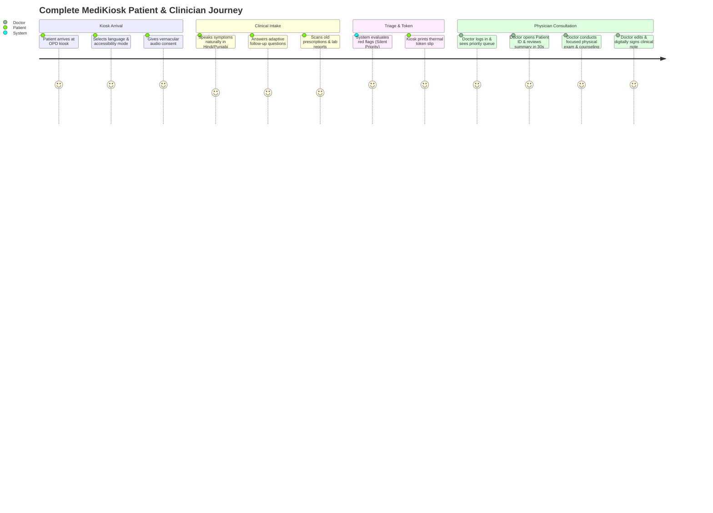

# MediKiosk — Product Requirements Document (product.md)

---

## 1. Product Overview & Vision

**MediKiosk** is an AI-powered, multilingual, accessibility-first clinical intake and decision-support platform engineered specifically for high-volume Outpatient Departments (OPDs) in Indian hospitals (Allopathic and AYUSH).

### 1.1 The Core Problem
In Indian government and charitable hospital OPDs, a physician sees between **80 and 150 patients per shift**, resulting in average consultation times of **2 to 5 minutes per patient**. During this narrow window, doctors are forced to spend the majority of the time manually collecting routine medical history, deciphering old handwritten prescriptions, and sorting through paper reports — leaving minimal time for physical examination, clinical reasoning, and counseling.

### 1.2 The Solution
MediKiosk captures the patient's comprehensive clinical history **before** they enter the doctor's cabin via an accessible kiosk, tablet, or web interface:
- Conducts an adaptive conversational interview in the patient's local tongue (Hindi, English, Punjabi, and regional languages) with automatic fallback to high-contrast touch mode if speech services or network drops occur.
- Digitizes old paper documents (prescriptions, lab tests, discharge summaries) with RapidFuzz NLEM drug dictionary matching and side-by-side verification crops.
- Evaluates clinical symptoms through a **two-tier red-flag triage engine** (Tier-1 Critical Red Alert vs. Tier-2 Amber Priority).
- Generates a **physician-ready structured clinical summary** and longitudinal timeline.
- Assigns an OPD token, auto-prints a physical thermal slip with an HMAC-signed anti-tamper QR code, and delivers the full record to the physician dashboard the instant the doctor enters or clicks the **Patient ID**.

> **Core Value Proposition:** MediKiosk does not diagnose or replace the clinician. It gives the doctor structured clinical intelligence before the consultation starts — saving 2–3 minutes of routine history taking per patient and increasing OPD capacity and clinical thoroughness.

---

## 2. Target Personas & User Journeys



### Persona 1: Elderly / Rural Patient (Non-Smartphone User)
* **Demographics:** 62-year-old farmer from a rural district, non-smartphone owner, speaks colloquial Hindi/Punjabi, low digital literacy.
* **Needs:** Simple interface with minimal text, audio prompts in local dialect, large buttons, canonical phone lookup supporting shared family numbers (non-unique blind index) without requiring an app, protected by Argon2id MPIN with 3-attempt brute-force lockout.
* **Journey:** Approaches kiosk $\rightarrow$ Taps Hindi $\rightarrow$ Listens to spoken audio $\rightarrow$ Speaks complaint naturally (or falls back to touch chips if noisy) $\rightarrow$ Scans old prescription $\rightarrow$ Takes printed physical paper token slip from kiosk with 64-bit anti-tamper QR code $\rightarrow$ Waits for token call on overhead display board.

### Persona 2: Visually Impaired Patient
* **Demographics:** 45-year-old individual with total visual impairment attending the hospital alone.
* **Needs:** 100% screen-independent voice navigation with zero requirement to locate touch buttons.
* **Journey:** Kiosk initiates auto-voice loop $\rightarrow$ Patient hears spoken instructions $\rightarrow$ Speaks symptoms using Voice Activity Detection $\rightarrow$ Confirms choices via spoken numbers or conversational responses $\rightarrow$ Receives audible token announcement.

### Persona 3: OPD Physician (Allopathic & Ayurvedic)
* **Demographics:** Senior Consultant seeing 120 patients/day in General Medicine or Kayachikitsa.
* **Needs:** Zero long chatbot transcripts; concise, structured, bulleted summary (CC $\rightarrow$ HPI $\rightarrow$ PMH $\rightarrow$ Meds $\rightarrow$ Allergies $\rightarrow$ ROS), highlighted abnormal lab values, and side-by-side crops of handwritten prescriptions for instant visual verification.
* **Journey:** Logs into web dashboard with Doctor ID $\rightarrow$ Selects next Patient ID from priority worklist $\rightarrow$ Reviews pre-structured summary, abnormal labs, and prescription crop in $<30$ seconds $\rightarrow$ Conducts physical examination and focused clinical interview $\rightarrow$ Confirms/edits note $\rightarrow$ Digitally signs to push to hospital EMR.

### Persona 4: Triage / Nursing Staff
* **Demographics:** OPD Floor Nurse managing patient queues and initial vital screenings.
* **Needs:** Real-time visibility into emergency symptoms, instant desktop buzzer alerts for acute presentations, manual department override capability.
* **Journey:** Receives instant flashing modal & buzzer alert for Tier-1 emergency (e.g., Chest Pain + Diaphoresis) $\rightarrow$ Intervenes immediately to move patient to the emergency bay $\rightarrow$ Overrides department routing if clinically warranted.

### Persona 5: Hospital Administrator
* **Demographics:** Medical Superintendent / Administrative Officer monitoring hospital throughput.
* **Needs:** Analytics on total OPD throughput, department-wise patient loads, intake completion rates, average wait times, and DPDP compliance audit logs with real client IP tracking (`X-Forwarded-For`).
* **Journey:** Logs into Admin Dashboard via Hospital SSO $\rightarrow$ Inspects live throughput KPIs and department metrics $\rightarrow$ Exports audit logs for statutory reporting.

---

## 3. Product Features & Epic Breakdown

### Epic 1: Multilingual Conversational Intake Engine (P0)
* **Allopathic Clinical Ontology (Full 7-Step SOCRATES):** Unbroken state machine structuring natural speech into Chief Complaint $\rightarrow$ HPI (Site, Onset, Character, Radiation, Associations, Timing, Exacerbating/Relieving, Severity 0–10) $\rightarrow$ Past Medical/Surgical History $\rightarrow$ Drug/Allergy History $\rightarrow$ Personal/Family History $\rightarrow$ Review of Systems $\rightarrow$ Summary Confirmation.
* **Dedicated AYUSH Intake Mode (Full 10 Dashavidha Pariksha + Ahara-Vihara) (P0):** Full parity for Ayurvedic OPDs with **10 Dashavidha Pariksha** parameters (*Prakriti, Vikriti, Sara, Samhanana, Pramana, Satmya, Sattva, Ahara Shakti, Vyayama Shakti, Vaya*) and *Ahara-Vihara/Nidana* lifestyle and Agni assessment (*Tikshnagni, Mandagni, Vishamagni, Samagni*).
* **Multi-Accent Speech Robustness & Graceful Fallback:** Semantic intent classification mapped over colloquial Hindi, English, and Punjabi regional dialects. If network connectivity drops or ASR confidence falls, the system automatically triggers seamless fallback to touch mode chips (`fallback_mode: TOUCH_SELECTION`).
* **Canonical E.164 Phone Normalization & Family Sharing:** Canonical phone normalization (`+91XXXXXXXXXX`) ensures deterministic blind-index searching. Non-unique phone search hash allows multi-generational family members sharing one mobile number to maintain separate clinical profiles.
* **Multi-Factor Patient & Staff Authentication:**
  - Patient Password, 4–6 digit Argon2id MPIN (with 3-attempt lockout), ABDM ABHA OTP, and Anonymous Walk-In mode.
  - Doctor & Staff ID login with mandatory RFC 6238 TOTP MFA verification.
  - Enterprise Admin SSO subject assertion with TOTP MFA verification (zero unauthenticated bypass).

### Epic 2: Universal Accessibility & Inclusive Design (P0)
* **Visually Impaired Audio-Guided Mode:** Zero-screen conversational turn-taking with VAD and spoken menus, fully compliant with WCAG 2.1 AA and Android TalkBack.
* **Low-Literacy & Elderly UI:** Large high-contrast touch chips (48px+ targets), visual body maps, 0–10 pain scales, slow-audio toggle, `[ 🔊 REPEAT ]` button.
* **Accessible Inactivity Lifecycle:** 3–5 minute timeout window with an audio check-in at 2.5 minutes (*"Are you still there?"*) and a `[ ⏸ I need more time ]` pause button.

### Epic 3: Document AI & Prescription Digitization (P0)
* **Multilingual OCR & Layout Parsing:** Scans printed and semi-legible handwritten prescriptions, lab panels, and discharge summaries.
* **Drug Dictionary Validation (RapidFuzz):** Cross-references extracted medications against NLEM, CDSCO, and Indian Pharmacopoeia databases using high-performance RapidFuzz (MIT licensed).
* **Abnormal Lab Extraction:** Automatically parses biological reference intervals printed on the report and highlights `HIGH` / `LOW` abnormal values.
* **Side-by-Side Verification Crop Viewer:** Attaches high-res bounding-box image crops directly adjacent to extracted entities on the doctor dashboard for 1-second verification.

### Epic 4: Two-Tier Clinical Triage & Red-Flag Engine (P0)
* **Slot-Scoped Triage Rules:** Multi-condition rules evaluating structured slots (e.g. Chest Pain AND Diaphoresis / Left Arm Radiation; Severity Score $\ge 8$).
* **Tier-1 Critical Emergency:** Detects high-urgency conditions $\rightarrow$ Triggers real-time desktop buzzer, confidential alert modal, silent priority queue sequencing, and generic operational SMS strictly to on-duty doctors and triage nurses of that department.
* **Tier-2 Amber Priority:** Detects urgent non-critical symptoms (severe pain $\ge 8/10$, high fever with rigors) $\rightarrow$ Silently advances patient in queue worklist without sounding audible alarms.
* **Privacy-Preserving Public Displays:** Public waiting-room screens display plain token numbers only (`Token #47 ➔ Room 12`); clinical alerts are visible strictly on authenticated staff dashboards.

### Epic 5: Smart Token, Queue Routing & Digital OPD Parchi (P1)
* **Deterministic Department Routing:** Rule-based clinical lookup table mapped from confirmed Chief Complaints (14 Allopathic & AYUSH departments) with 1-tap confirmation and staff override.
* **Physical Thermal Token Slip (Default):** Auto-printed at the kiosk with an opaque, 64-bit HMAC-signed QR code (zero plain health text in barcode), validated at doctor check-in via `verify_signed_qr_token` with 24-hour expiration enforcement.
* **Digital OPD Parchi (Convenience):** Available via SMS link or web portal for smartphone users without requiring app installations.

### Epic 6: Unified Role-Based Portals (P0 / P1)
* **Doctor Interface:** Web dashboard featuring real-time OPD queue worklist (`GET /doctor/opd-queue`), universal hotkey Patient ID search (`GET /doctor/patient-lookup/{patient_id}` returning session, summary, abnormal labs, crops, and timeline), editable summary form, and 1-click clinical sign-off (`PUT /doctor/summary/{summary_id}/sign`).
* **Patient Portal (MyMediKiosk PWA):** Pre-visit document upload, verified timeline viewer, Digital Parchi access, DPDP consent/data-erasure controls (`GET /patient/consent-history`, `POST /patient/data-erasure-request`), and secure single-use token merge flow for temporary walk-in patients.
* **Administrator Dashboard:** Hospital throughput analytics overview (`GET /admin/analytics/overview`), department queue depth, completion rates (`v_opd_intake_metrics`), and tamper-evident audit logs with client IP tracking.

### Epic 7: Privacy, Consent & ABDM/FHIR Interoperability (P0)
* **DPDP Act 2023 Compliance:** Vernacular audio consent recording, ephemeral kiosk RAM and Redis session cache clearing, Data Principal rights (access, correction, erasure).
* **Dual-Path Temporary Walk-In Merge Protocol:**
  - Accepts a structured request body (`MergeTemporaryPatientRequest`) containing `temp_patient_id` and `verification_session_token` (preventing token leakage into URL query strings or proxy logs).
  - Enforces single-use token consumption via Redis `SETNX` anti-replay guard and validates JWT claim `purpose: MERGE_VERIFICATION`.
  - Enforces database state pre-conditions: verifies source patient has `is_temporary == TRUE` and target patient exists as a valid permanent record before executing atomic updates across `visit_sessions`, `clinical_summaries`, `medical_documents`, `token_records`, `consent_records`, and `triage_alerts`.
  - Emits immutable audit log with real requester IP (`X-Forwarded-For`).
* **ABDM FHIR R4 Bundle Serializer (`fhir_adapter.py`):** Generates standard `Patient`, `Condition`, `Observation`, `MedicationStatement`, and `DocumentReference` FHIR R4 JSON bundles.

---

## 4. Priority Matrix (MVP vs. Roadmap)

| Feature Module | Priority | Target Delivery |
| :--- | :--- | :--- |
| Role-Based Auth Gateway (Patient / Doctor / Staff / Admin) | **P0** | MVP / Hackathon |
| Multilingual Voice Intake (Hindi & English) + Touch Fallback | **P0** | MVP / Hackathon |
| Dedicated AYUSH Mode (10 Dashavidha Pariksha + Ahara/Vihara) | **P0** | MVP / Hackathon |
| Visually Impaired Audio-Guided Conversational Loop | **P0** | MVP / Hackathon |
| Two-Tier Red-Flag Detection (ACS, Stroke, Severe Pain) | **P0** | MVP / Hackathon |
| Document OCR, Drug Dictionary & Side-by-Side Crop Viewer | **P0** | MVP / Hackathon |
| Doctor Interface with Universal Patient ID Search & Sign-Off | **P0** | MVP / Hackathon |
| Ephemeral Kiosk Memory & Accessible Inactivity Window | **P0** | MVP / Hackathon |
| Punjabi Speech Pipeline (`bhashini_asr_pa` / `tts_pa`) | **P1** | Phase 1 Polish |
| Deterministic Department Router & Printed Slip / Digital Parchi | **P1** | Phase 1 Polish |
| MyMediKiosk Patient Web Portal & DPDP Data Rights | **P1** | Phase 1 Polish |
| Administrator Dashboard & `v_opd_intake_metrics` View | **P1** | Phase 1 Polish |
| Dual-Path Temporary Record Merge (Body Payload + Single-Use Redis Anti-Replay) | **P1** | Phase 1 Polish |
| Mock ABDM FHIR R4 Export Gateway | **P1** | Phase 1 Polish |
| Animated Sign-Language Avatar Assistant | **P2** | Production Roadmap |
| Advanced Neural Handwriting Decoders | **P2** | Production Roadmap |
| Direct Hospital Hardware QMS & Turnstile Integration | **P2** | Production Roadmap |
| Drug-Drug Interaction Warning Service | **P2** | Production Roadmap |

---

## 5. Key Success Metrics & KPIs

```
                          ┌──────────────────────────┐
                          │   CORE PRODUCT METRICS   │
                          └─────────────┬────────────┘
                                        │
             ┌──────────────────────────┼──────────────────────────┐
             ▼                          ▼                          ▼
   [ CLINICAL EFFICIENCY ]     [ INTAKE ACCURACY ]       [ ACCESSIBILITY & UX ]
   • Consultation time saved   • Extraction Accuracy:    • Kiosk completion rate:
     (target: 2.5 min/pt)        - Meds: >95% (NLEM)       >88% without staff aid
   • Doctor review latency:      - Labs: >98%            • Audio-mode completion:
     <30 seconds               • Triage Sensitivity:       >82% for visually impaired
   • Daily OPD throughput:       >99% for Tier-1 ACS     • Abandonment rate:
     +25% to 35% increase      • Zero autonomous dx        <5% across all age groups
```

---

## 6. Regulatory, Clinical Safety & Compliance Mandates

1. **Non-Diagnostic Policy:** The platform shall never display or communicate a definitive medical diagnosis to the patient. All red-flag triggers are classified as *Triage Assessment Alerts* for clinical prioritization.
2. **Physician Sign-Off Gatekeeper:** AI-generated intake summaries are stored as non-statutory drafts (`is_draft = TRUE`). A record becomes part of the permanent medical record only after an authenticated doctor digitally edits, confirms, and signs it.
3. **DPDP Act 2023 Compliance:** 
   - Explicit vernacular audio-visual consent captured with timestamp and purpose before data entry.
   - Zero health data stored permanently on physical kiosk terminals (ephemeral memory wiped on timeout/completion).
   - Patients retain full rights to request correction or cryptographic data erasure.
   - Tamper-evident audit logging with real client IP (`X-Forwarded-For`) extraction.
4. **Zero Plaintext Secrets in Production:** Zero credentials or KMS keys committed to version control; `.env` excluded via `.gitignore`; production deployments dynamically fetch secrets from enterprise key vaults (AWS Secrets Manager / Vault).
5. **ABDM Standards:** Built to comply with ABDM milestones M1 (ABHA creation), M2 (HIP clinical record generation), and M3 (HIU health data view).
